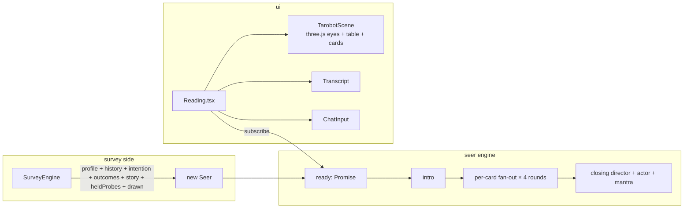
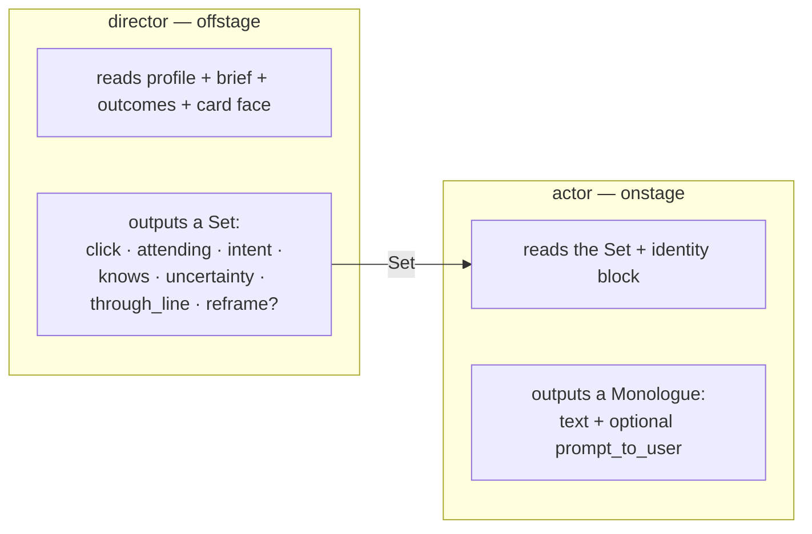
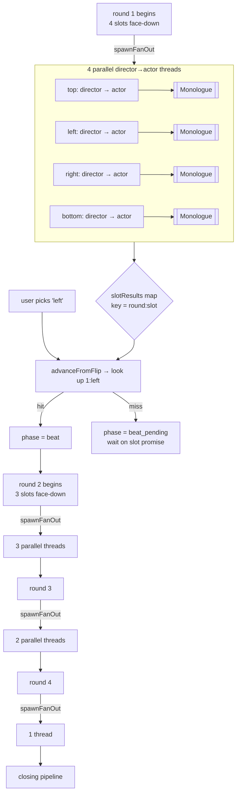
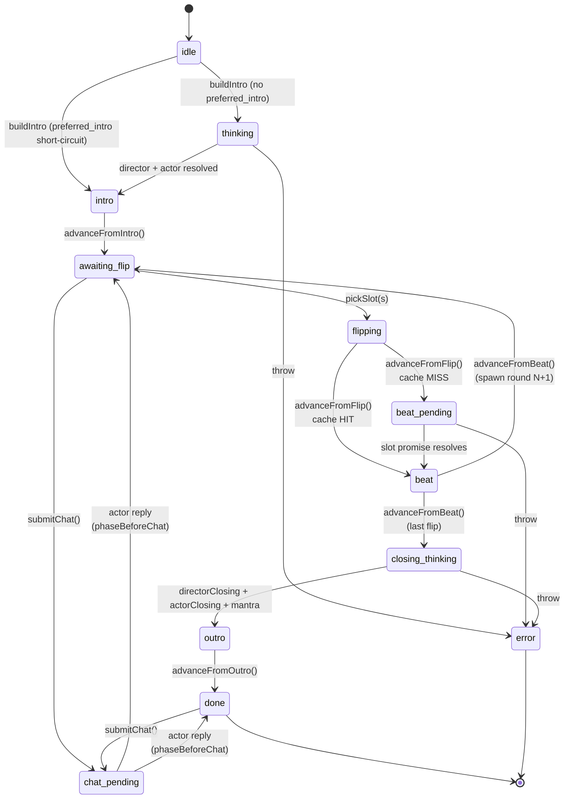
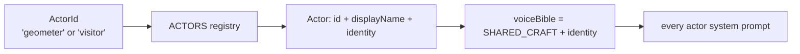
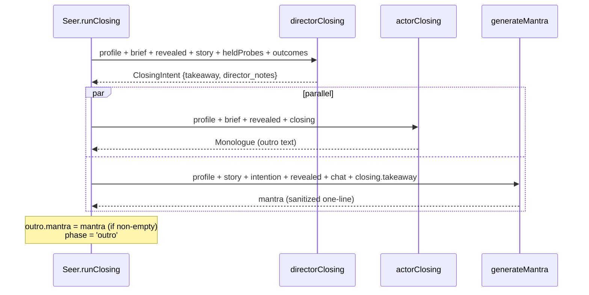
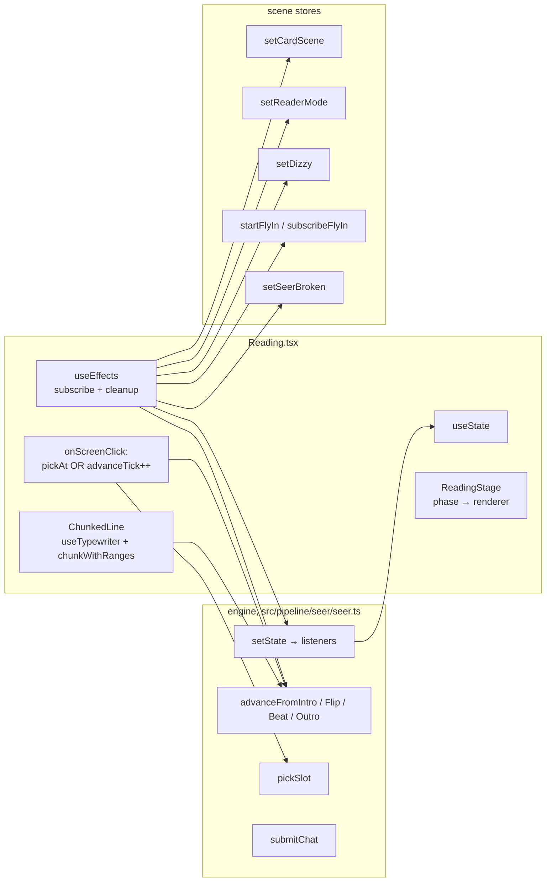
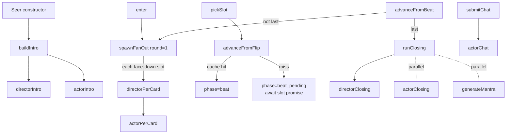

# the reading — an anatomy

A deep-dive on the reading subsystem (`src/pipeline/seer/`, `src/ui/Reading.tsx`,
`materials/prompts/seer/`). Snapshot of branch `survey-engine-v3` at the time
of writing; this corner of the codebase is churning (slot meanings + the fan-out
are stable, the actor voice + the closing mantra are not), so when something
here looks wrong, trust the source.

The reading is the destination the rest of the app serves. The survey hands
the Seer four things — a `Profile`, a `surveyHistory`, an `intention`, and
an `outcomes` list — plus a fresh 4-card draw from `cards.ts`. From that
moment forward, the reading owns the screen.

---

## 1. the shape, at a glance



Two layers inside the engine: the **director** (offstage, clinical, plans
the Set) and the **actor** (onstage, voiced, performs the Set). The split
is load-bearing — see §3.

Four tranches the engine orchestrates:

| tranche  | shape                                | when                                   |
|----------|--------------------------------------|----------------------------------------|
| intro    | director → actor (serial)            | once, at construction                  |
| per-card | director → actor (fan-out, speculative) | round 1..4, before each user pick   |
| chat     | actor only                           | user-initiated, allowed in two phases  |
| outro    | director → actor + mantra (parallel) | after the 4th flip                     |

---

## 2. file map

| concern                                      | file                                                 |
|----------------------------------------------|------------------------------------------------------|
| Engine class + state machine + fan-out       | `src/pipeline/seer/seer.ts`                          |
| Director call wrappers (per-card / intro / closing) | `src/pipeline/seer/agents/director.ts`        |
| Actor call wrappers (per-card / intro / closing / chat) | `src/pipeline/seer/agents/actor.ts`       |
| Zod schemas at the adapter boundary          | `src/pipeline/seer/schemas.ts`                       |
| Director prompts (system + ToolDef)          | `src/pipeline/seer/prompts/director.ts`              |
| Actor prompts (builders + ToolDef)           | `src/pipeline/seer/prompts/actor.ts`                 |
| Prompt bodies (markdown, `?raw`-imported)    | `materials/prompts/seer/*.md`                        |
| Closing-mantra agent (freeform)              | `src/pipeline/seer/mantra.ts`                        |
| Actor registry (geometer / visitor)          | `src/pipeline/seer/actors/`                          |
| Demo fixture (Marisol)                       | `src/pipeline/seer/fixtures.ts`                      |
| Engine types (Phase, ReadingState, Set...)   | `src/pipeline/seer/types.ts`                         |
| Text sanitizer (em-dash → spaced ellipsis)   | `src/pipeline/seer/sanitize.ts`                      |
| Latency catchphrases ("hmm…", "i see…")      | `src/pipeline/seer/fillers.ts`                       |
| Director/actor stall pools                   | `src/pipeline/seer/stalls.ts`                        |
| Public surface (re-exports)                  | `src/pipeline/seer/index.ts`                         |
| Reading screen (DOM anchors + chunked typer) | `src/ui/Reading.tsx`                                 |
| Transcript shelf / fullpage view             | `src/ui/Transcript.tsx`                              |
| Spread definition (FOUR_CARD_DIAMOND)        | `src/pipeline/spreads.ts`                            |
| Card draw                                    | `src/pipeline/cards.ts`                              |

---

## 3. the director / actor split

The thing that makes the reading work is that it is two model calls,
not one. The **director** call thinks; the **actor** call speaks. They
never get collapsed into a "do both" prompt.



A **Set** is Stanislavski's "given circumstances" — the interior the
performer walks onto. It is not a script. The actor inhabits it; the
words emerge from the prepared mind. From `src/pipeline/seer/types.ts:92-132`:

| field          | role                                                         |
|----------------|--------------------------------------------------------------|
| `click`        | the small "ah" at the moment of the flip; 1-2 sentences      |
| `attending`    | the thread in the profile this card surfaces; 1 sentence     |
| `intent`       | a single verb-phrase ("agitate the cope", "settle the room") |
| `knows`        | 0-5 specific facts the actor MAY surface (under-spec on purpose) |
| `uncertainty`  | what's genuinely unclear; 0-1 sentence; eerier than false confidence |
| `through_line` | binds the beat to THE choice without naming it directly      |
| `reframe?`     | optional `{user_belief, cards_invitation}`; at most one per reading |

Why two calls?

- Alignment-trained models pull toward helpful-and-clear, which is the
  opposite of what the seer needs. Asking one prompt to both reason
  carefully *and* perform character collapses the reasoning.
- The split is the seam the eventual local-LLM swap rides on: actor
  routes to `model: 'deep'` today and eventually to an on-prem
  uncensored OSS model; director stays on cloud Claude where reasoning
  quality dominates.

`actorChat` is the one exception — `model: 'cognition'` instead of
`deep` (see `agents/actor.ts:139`). Cuts ~50% off chat-reply latency
in exchange for slightly less voice fidelity. Defensible because chat
is lower-stakes than the beats.

---

## 4. the fan-out

The single most-non-obvious thing in the reading: at the start of every
round, the engine spawns one director + actor pair per still-face-down
slot, in parallel, speculatively. When the user picks slot S, the
already-computed monologue for `[round, S]` is just pulled from cache.



Two invariants the fan-out preserves:

1. **Each director thread sees only its own slot's face.** It gets
   `all_positions` (id + role + prompt_label for every slot) and
   `revealed_history` (cards already flipped + beats already
   delivered) — but the faces of the other still-face-down slots are
   withheld. Without this, the round-1 monologues become a single-shot
   "plan all four beats and write the one you're picking" — a Plan-and-Write
   in disguise. The constraint forces the director to commit to a beat
   that makes sense *with the current information only*. See
   `seer.ts:424-499` and the director system prompt
   (`materials/prompts/seer/director-per-card.md:3`).

2. **Speculative work is thrown away.** In round 1, four threads
   compute; only one monologue is shown. The other three slots get
   recomputed in round 2 with new context (revealed_history grew by
   one beat). The engine deliberately spends `4+3+2+1 = 10` director +
   10 actor calls to hide latency behind the user reading whatever just
   finished.

The cache key is `${round}:${slot}` (see `roundKey`, `seer.ts:556`).
`slotPromises` holds the in-flight `Promise<SlotResult>`; `slotResults`
holds the resolved value. `advanceFromFlip` checks `slotResults` first
(synchronous hit) and falls through to awaiting the promise (`beat_pending`,
shows actor-tier stall).

There's a belt-and-suspenders branch where `spawnFanOut` is re-invoked
defensively if a slot promise is somehow missing (`seer.ts:271-285`).

---

## 5. the state machine



States, source of truth = `ReadingPhase` in `src/pipeline/seer/types.ts:173-185`:

| phase              | meaning                                                       |
|--------------------|---------------------------------------------------------------|
| `idle`             | not started (constructor instant)                             |
| `thinking`         | intro generation in flight                                    |
| `intro`            | intro typewriter active                                       |
| `awaiting_flip`    | user can pick a face-down card or chat                        |
| `flipping`         | CSS-3D flip animation playing (`FLIP_ANIM_MS = 950`)          |
| `beat_pending`     | monologue not ready (fan-out still in flight)                 |
| `beat`             | monologue typewriter active                                   |
| `chat_pending`     | actor generating reply to chat                                |
| `closing_thinking` | director + actor running after 4th flip                       |
| `outro`            | closing monologue typewriter active                           |
| `done`             | reading complete; chat still possible                         |
| `error`            | unrecoverable; UI shows SeerError + close                     |

Side channel: `awaiting_layer: 'director' | 'actor' | null` tells the
UI which kind of stall to render. Director stalls and actor stalls
render in different colors so it's visually obvious which layer the
system is waiting on (`Reading.tsx:431,448`).

Subscribers: `engine.subscribe(fn)` returns an unsubscribe. `setState`
fans out to every listener inside a try/catch (swallows listener
errors so one bad subscriber can't crash the engine).
`Reading.tsx:83` subscribes; the e2e harness can subscribe too.

---

## 6. end-to-end sequence (one reading)

```mermaid
sequenceDiagram
  autonumber
  participant U as user
  participant UI as Reading.tsx
  participant E as Seer engine
  participant D as director (cloud)
  participant A as actor (cloud today,<br/>local OSS later)
  participant M as mantra (cloud)

  Note over E: new Seer(opts) — constructor kicks off
  E->>D: directorIntro(profile, story, history, outcomes)
  D-->>E: prose_brief (stored on inputs)
  E->>A: actorIntro(profile, prose_brief)
  A-->>E: Monologue (intro)
  Note over E: ready resolves<br/>phase = 'intro'

  U->>UI: tap [ENTER]
  UI->>E: enter() — spawn round-1 fan-out
  par 4 threads in parallel
    E->>D: directorPerCard(top, round=1)
    D-->>E: Set
    E->>A: actorPerCard(top, Set)
    A-->>E: Monologue
  and
    E->>D: directorPerCard(left, round=1)
    D-->>E: Set
    E->>A: actorPerCard(left, Set)
    A-->>E: Monologue
  and
    E->>D: directorPerCard(right, round=1)
    D-->>E: Set
    E->>A: actorPerCard(right, Set)
    A-->>E: Monologue
  and
    E->>D: directorPerCard(bottom, round=1)
    D-->>E: Set
    E->>A: actorPerCard(bottom, Set)
    A-->>E: Monologue
  end
  Note over E: slotResults caches 4 entries<br/>(speculative; 3 will be discarded)

  U->>UI: pick 'left'
  UI->>E: pickSlot('left') — phase=flipping
  Note over UI: 950ms CSS-3D flip
  UI->>E: advanceFromFlip() — cache HIT (1:left)
  Note over E: phase = beat
  U->>UI: tap to advance
  UI->>E: advanceFromBeat()
  Note over E: phase = awaiting_flip<br/>spawn round-2 fan-out (3 threads)

  loop rounds 2, 3, 4
    Note over E,A: ~7 more director+actor pairs total<br/>(3+2+1 across the remaining rounds)
  end

  Note over E: 4th flip done — runClosing()
  E->>D: directorClosing(profile, brief, revealed, story, heldProbes)
  D-->>E: ClosingIntent {takeaway, director_notes}
  par parallel — hide mantra latency behind actor outro
    E->>A: actorClosing(profile, brief, closing)
    A-->>E: Monologue (outro text)
  and
    E->>M: generateMantra(profile, story, closing_takeaway, ...)
    M-->>E: mantra (sanitized one-liner)
  end
  Note over E: outro.mantra populated<br/>phase = 'outro'

  U->>UI: tap through outro
  UI->>E: advanceFromOutro()
  Note over E: phase = 'done'<br/>chat still allowed
```

---

## 7. inputs and outputs by agent

The director and actor both share `LLMAdapter` (`src/pipeline/llm/adapter.ts`),
which routes through `AnthropicAdapter` (the only file that imports the SDK).
Zod schemas validate every response; the adapter retries once with an
explicit "your previous response failed schema validation" follow-up.

| call               | model tier | max_tokens | tool name        | schema                | returns                            |
|--------------------|------------|-----------:|------------------|-----------------------|------------------------------------|
| `directorIntro`    | cognition  | 1200       | `plan_intro`     | ad-hoc `{prose_brief, reasoning}` | `prose_brief: string`          |
| `directorPerCard`  | cognition  |  700       | `prepare_set`    | `SetSchema`           | `Set`                              |
| `directorClosing`  | cognition  |  800       | `plan_closing`   | `ClosingIntentSchema` | `ClosingIntent`                    |
| `actorIntro`       | deep       |  200       | `voice_intro`    | `MonologueSchema`     | `Monologue`                        |
| `actorPerCard`     | deep       |  500       | `voice_beat`     | `MonologueSchema`     | `Monologue`                        |
| `actorClosing`     | deep       |  300       | `voice_closing`  | `MonologueSchema`     | `Monologue`                        |
| `actorChat`        | cognition  |  300       | `voice_chat`     | `MonologueSchema`     | `Monologue`                        |
| `generateMantra`   | cognition  |  120       | (freeform)       | (sanitizer only)      | `string` (may be empty on failure) |

Tier → model mapping lives in `src/pipeline/llm/adapter-anthropic.ts:25-29`:

```
fast      → claude-haiku-4-5
cognition → claude-sonnet-4-6
deep      → claude-opus-4-7
```

Note: the `claude.ts` `MODELS` const at the top of the pipeline still
hard-codes only `COGNITION` and `TINY`; the active tier map is the one
in the adapter file. (The `claude.ts` constants look stale, but they're
not on the hot path — they're used by `validateKey` only.)

What every director call receives (beyond its own specifics):

- `profile` — the survey's compiled Profile (identity, candidates,
  cast, hunches, margin, cognition_log, highlights, observer_body,
  observer_hooks, observer_edges, observer_side_channel).
- `prose_brief` — the intro director's output; stored on
  `state.inputs.prose_brief` and re-read by per-card + closing.
- `outcomes` — Augur-seeded futures (id + label + freeform markdown
  document). Per-card director picks the one this card sharpens and
  embeds a specific from it into the Set. **Actor never sees these
  directly** — only the Set the director compiled.

What every actor call receives:

- `identity` + `prose_brief` — ground truth, by reference.
- A voice bible: `SHARED_CRAFT` (mechanical rules — no AI phrasing,
  no stock mystic filler, lowercase, no break-character) + the
  selected Actor's identity block.
- Whatever the call needs (Set, closing, chat history, etc.).

---

## 8. the actor registry — voice without director coupling



`DEFAULT_ACTOR_ID` is `'visitor'` (the silly-alien tarot reader). The
geometer (cold clinical instrument) stays in the registry as an opt-in.
Adding a new voice = a file in `src/pipeline/seer/actors/`, a registry
entry, and an `ActorId` extension. The director's Set is voice-agnostic;
only the actor prompts get re-stitched per voice.

The shared craft (`materials/prompts/seer/voice-bible.md`) is narrow on
purpose — just mechanical rules. The "mirror-not-oracle" framing that
used to live in the shared block was pulled out because it was making
the model hedge to vagueness without reliable benefit. Each voice is as
direct as its register warrants (see `src/pipeline/seer/actors/shared-craft.ts:3-8`).

---

## 9. four-card diamond — slot meanings

```
                 TOP
                  ◇
        LEFT  ◇       ◇  RIGHT
                  ◇
                BOTTOM
```

The reading is mirror-shaped. Slot meanings, per the director system
prompt (`materials/prompts/seer/director-per-card.md:37-42`):

| slot   | meaning                                                                  |
|--------|--------------------------------------------------------------------------|
| top    | what surrounds the participant at this fork; what they bring in          |
| left   | option A on the fork; what is unseen about pulling that direction        |
| right  | option B on the fork; what is unseen about pulling that direction        |
| bottom | the unaddressed factor; the thing they are not framing as part of this decision |

The spread file (`src/pipeline/spreads.ts`) carries slightly different
`prompt_label` strings (e.g. top = "what surrounds the choice; what is
at stake right now"). Both get passed to the director — `prompt_label`
shows up in `all_positions`, the canonical wording above is in the
system prompt. The wording in the system prompt is the load-bearing
version; the spread label is texture.

Narrative role is derived from flip **order**, not slot identity
(`seer.ts:92-97`):

| flip_round | narrative_role |
|-----------:|----------------|
| 1          | opening        |
| 2          | rising         |
| 3          | turning        |
| 4          | closing        |

So the same slot can be `opening` in one reading and `turning` in
another, depending on when the user chose to flip it.

---

## 10. cost model — calls per reading

For a full 4-card reading with no chat:

- **1** intro director (skipped on the demo path; `preferred_intro`
  short-circuits both intro calls)
- **1** intro actor (skipped on demo)
- **10** per-card directors (4 + 3 + 2 + 1, one per still-face-down slot
  per round)
- **10** per-card actors (one per director)
- **1** closing director
- **1** closing actor
- **1** mantra (freeform, parallel with actor outro)
- **N** chat actors (user-initiated, allowed in `awaiting_flip` /
  `done`)

= **25 LLM calls** baseline, plus chat. Wasteful by design — the
3 speculative round-1 monologues that get discarded buy the latency
hiding *and* the no-cheating constraint on the director. (CLAUDE.md
quotes ~23; that count predates the mantra agent + counts intro at one
combined step.)

The demo path (`buildMarisolDemoSeer`, `src/pipeline/seer/fixtures.ts:166`)
skips intro generation entirely. The `prose_brief` is hand-authored and
written directly into the engine's internal state via a deliberate cast
(`fixtures.ts:183`).

---

## 11. latency theater

The engine never shows a generic spinner. Two distinct masking systems:

**Fillers** (`fillers.ts`) — short phrases like "hmm…", "i see…",
"closer…" that rotate every 1.3–2.9s while a blocking call is in flight.
`pickFiller(prev)` avoids repeating the previous phrase. Driven by
`FillerLine` in `Reading.tsx:483-509`. Displayed during `idle`,
`thinking`, `flipping`, `beat_pending`, and `closing_thinking`.

**Stalls** (`stalls.ts`) — two pools, keyed by which layer the user
is waiting on:

| layer    | tone                                    | sample                                       |
|----------|-----------------------------------------|----------------------------------------------|
| director | longer, more philosophical              | "looking into my crystal ball...", "the pattern is forming. give it room." |
| actor    | shorter, more in-character              | "give me a moment to find the words.", "mm." |

The transcript shelf uses `pickStall('actor')` to render a one-line
"the seer is thinking" entry during `chat_pending` (`Transcript.tsx:41`).
The main stage uses `FillerLine` and gets its layer label from
`state.awaiting_layer` — so director-tier waits and actor-tier waits
render in visually distinct classes (`reading__filler--director` /
`reading__filler--actor`).

Other latency-hiding mechanics:

- **dizzy** scene flag — `setDizzy(true)` while any call is in flight.
  Drives a subtle three.js effect on the eyes anchor.
- **round-1 fan-out during intro** — `engine.enter()` is called as the
  cinematic camera fly-in finishes (`Reading.tsx:82-90`), so round-1
  monologues compute speculatively while the user reads the intro.
- **closing mantra in parallel with actor outro** — see §12.

---

## 12. the closing pipeline



The closing director gets one extra piece of input: `heldProbes` — the
top-5 hypotheses that survived the survey unintegrated and unrefuted
(sorted by `age_in_turns DESC`; older = more durable). The prompt
licenses ONE risky swing per reading: "there's something you haven't
said about X — i'm guessing it's because Y." Optional theatrical move.

The mantra agent (`src/pipeline/seer/mantra.ts`) is unusual — it's the
only seer call that uses `invokeFreeform` (no tool, no JSON schema).
The output is sanitized by `sanitizeMantra`: strips markdown markers,
emoji, surrounding quotes, "mantra:" preambles; collapses newlines;
hard-caps at 120 chars. Returns the empty string on adapter failure
(swallowed) so the UI just doesn't render a mantra row.

Why freeform? Because the next consumer is a human (the user reads it
on-screen), not the engine. JSON-shaped output would constrain
expressivity without any downstream parsing benefit.

The mantra renders post-outro in the `done` phase
(`Reading.tsx:466-470`), as a small `<div class="reading__mantra">`
beneath the outro text. Designed to be "ticker-tape-printable" — no
markdown, no emoji, no em-dashes (which the mantra prompt explicitly
calls out as printing badly).

---

## 13. the chat lane

```mermaid
flowchart TD
  CAN{phase ∈<br/>{awaiting_flip, done}?}
  CAN -->|no| DROP[submitChat returns]
  CAN -->|yes| SAVE[phaseBeforeChat = current phase]
  SAVE --> UMSG[push user message to state.chat]
  UMSG --> PEND[phase = chat_pending<br/>awaiting_layer = actor]
  PEND --> CALL[actorChat → cognition tier]
  CALL -->|success| SEER[push seer message]
  CALL -->|throw| FB[push in-character fallback:<br/>'the cards did not speak just then. ask again.']
  SEER --> RESTORE[phase = phaseBeforeChat]
  FB --> RESTORE
```

`canSendChat()` (`seer.ts:404`) returns true only in `awaiting_flip` /
`done`. The UI mirrors this in `ChatForm` (`Reading.tsx:743-761`) — the
input is disabled outside those phases.

Key details:

- The actor's `Monologue` includes an optional `prompt_to_user`. When
  populated, the UI surfaces it as a hint above the chat input
  (`Reading.tsx:756`). Cleared when the user either picks a card or
  sends a chat.
- Chat replies are cached as `state.chat` but **not played through the
  typewriter** as a new beat — they're shown as the most-recent seer
  line in the dialogue panel during `awaiting_flip` (`Reading.tsx:413-426`)
  and as standard rows in the transcript shelf.
- The actor-side prompt explicitly says: stay in character, don't
  explain how tarot works, don't retract a true thing under pushback,
  redirect to "we will get there" if asked about an unflipped card
  (`materials/prompts/seer/actor-chat.md:9-15`).
- Director-side chat is in the TODO backlog — today the chat
  reply is actor-only, with no director planning pass. This means the
  reply has less ground-truth grounding than beats do.

The fallback line is hard-coded so even an adapter blow-up doesn't
break the seer's character. The thrown error is swallowed at
`seer.ts:387-400`.

---

## 14. text sanitization & emphasis

Two stages of text mutation between the model's bytes and the user's eyes:

**Engine-side** (`src/pipeline/seer/sanitize.ts`) — runs on every
`Monologue` before storage. Stored values pass through this, so the
*model sees the sanitized text* on subsequent calls too:

- `—` and `–` (em / en dashes) → `". . ."` (spaced ellipsis)
- `…` (single char) → `". . ."`
- `...` (3+ periods) → `". . ."`
- double-spaces collapsed
- trim

User dislikes em-dashes in dialogue (per a saved feedback memory
elsewhere). Spaced ellipsis carries the same beat with the rhythm
the user prefers.

**UI-side** — the actor wraps emphasized phrases in single underscores
(`_like this_`, per `materials/prompts/seer/actor-per-card.md:31`).
`parseEmphasis` extracts ranges; `ChunkedLine` renders them with a
hindsight-animated underline (`Reading.tsx:530-684`). The underscores
themselves are stripped for the transcript view (`Transcript.tsx:33-35`).

Names get color-emphasized in real time: `highlightNames` walks the
text and wraps the user's name (from profile) and any drawn card's
name in a brand-violet span (`Reading.tsx:202-205`).

---

## 15. error handling

The engine surfaces errors via `phase: 'error'` + `state.error: string`.
Three call sites can transition to error:

- intro pipeline (`buildIntro` catches; `seer.ts:188-194`)
- per-card fan-out (catch attached when the consumer awaits the slot
  promise; `seer.ts:278-282`)
- closing pipeline (`runClosing` catches; `seer.ts:539-545`)

Chat is the outlier — it falls back to the in-character "the cards did
not speak just then. ask again." line instead of transitioning to error.
Rationale: the reading should continue; a transient chat blip shouldn't
torch the session.

When `phase = 'error'`, `Reading.tsx:107` publishes `setSeerBroken(true)`
to the scene store, which switches the eyes to crossed-out "X" mode.
The UI renders `<SeerError>` in the dialogue slot and surfaces a close
button. No retry path — by the time the engine has crashed, the
already-revealed beats are still in `state.revealed` and worth seeing,
but the rest of the reading is forfeit.

---

## 16. ui ↔ engine contract



The reading screen does **no business logic**. It:

1. Subscribes to engine state via `engine.subscribe(setStateLocal)`.
2. Maps the current phase to one of: `FillerLine`, `ChunkedLine(intro)`,
   `ChunkedLine(beat)`, `ChunkedLine(outro)`, the "last seer chat reply"
   view, the post-`done` outro+mantra panel, or `SeerError`
   (`Reading.tsx:390-475`).
3. Drives the CSS-3D flip via `setTimeout(FLIP_ANIM_MS=950, advanceFromFlip)`
   when `phase === 'flipping'` (`Reading.tsx:117-121`).
4. Forwards screen clicks: if `pickable && pickAt` hits a card →
   `engine.pickSlot(slot)`; otherwise bump `advanceTick` (the
   typewriter listens for this and either skips its animation or
   advances to the next chunk; `Reading.tsx:258-276`).
5. Mirrors engine state into scene stores: `setCardScene({drawn,
   stages, pickable})`, `setDizzy(awaiting_layer !== null)`,
   `setSeerBroken(phase === 'error')`.

A small but load-bearing UI detail: `ChunkedLine` chunks long
monologues at sentence boundaries (≤ `CHUNK_MAX_CHARS = 200`) so the
rigid dialogue box never resizes. The chunker also translates emphasis
ranges into chunk-local coordinates so the underline animation lines
up after the split (`Reading.tsx:635-679`).

---

## 17. how the survey hands off

The survey engine constructs the Seer at close
(`src/pipeline/survey/engine.ts:570-580`):

```ts
this.seer = new Seer({
  adapter: this.opts.adapter,
  profile,
  surveyHistory: this.state.picks_log,
  intention: cleaned,
  drawn,
  outcomes,
  story: this.state.doc.story,
  heldProbes: heldProbesForSeer,
});
await this.seer.ready;
this.setState({
  closed: true,
  close_reason: 'cap',
  stage: 'reading_ready',
  thinking: false,
});
```

`await this.seer.ready` is the gate. The Seer constructor synchronously
kicks off `buildIntro`; `ready` resolves when the intro Monologue is
materialized (or rejects on intro failure). The survey doesn't expose
the Seer to `App.tsx` until `stage === 'reading_ready'`, so the
[ENTER] button is only clickable when the intro is already in the bag.

The `heldProbes` array goes through a `claim → description` rename at
the boundary (a v2 → seer shape adapter); the Seer code stays
untouched.

The demo path bypasses the survey entirely — `buildMarisolDemoSeer`
constructs a Seer with a hand-authored Profile and `preferred_intro`,
which short-circuits both intro calls and drops the prose_brief
straight into engine state. Useful for iterating on the reading
without burning survey time on every walkthrough.

---

## 18. stable vs. churning vs. deferred

**Stable** (touch carefully):

- `Set` shape (`types.ts:92-132`) — load-bearing across director +
  actor + cache.
- Phase enum (`types.ts:173-185`) — UI mapping in `Reading.tsx`
  branches off every phase by name.
- Fan-out invariants — see §4. Each director thread sees ONLY its own
  slot's face; round 1 spawns 4 threads; round N spawns `4 − revealed`.
- Slot meanings — see §9. The four-card-diamond slot semantics are
  threaded through director prompt + the eventual outcome of the
  reading. Changing them changes the reading.
- `LLMAdapter` interface — the seam the local-OSS-LLM swap rides.

**Churning** (expect change):

- Actor voice prompts (`materials/prompts/seer/actor-*.md`) and the
  individual Actor identity blocks (`actors/geometer.ts`,
  `actors/visitor.ts`). Per `CLAUDE.md`: real voice iteration requires
  real users in front of it; burning cycles on prompt-wordsmithing in
  a vacuum produces nothing that survives contact.
- Closing mantra — agent shipped recently; the register / fallback
  behavior is still finding its shape.
- Chat lane — actor-only today. Director-side chat is in the TODO
  backlog. When that lands, the chat-reply prompt will get the same
  ground-truth-grounding the beats have.
- `FLIP_ANIM_MS = 950` — flagged as a placeholder number in `CLAUDE.md`.
- Card faces — currently unicode-glyph + roman-numeral placeholders;
  the perspective canvas painters in `src/ui/cards/` render them. Real
  art replaces this later; the contract (each card has a glyph + label)
  stays.

**Deferred** (stubs only):

- Director-side chat planning pass.
- Local OSS LLM swap — `LLMAdapter` interface exists for this. The
  director / actor split was specifically engineered so the actor
  layer can repoint to a local model without disturbing the director.
- Re-opening a finished reading from a persisted snapshot. Sessions
  currently only persist mid-survey; once a reading completes, the
  full reading state is in-memory only.

---

## appendix A — minimal call graph



## appendix B — what the actor never sees

The director sees more than the actor. By design.

| input                       | director | actor |
|-----------------------------|:--------:|:-----:|
| profile                     |    ✓     |   ✓   |
| prose_brief                 |    ✓     |   ✓   |
| outcomes (Augur documents)  |    ✓     |       |
| story (StoryObject)         |  intro + closing  |       |
| heldProbes                  |  closing only  |       |
| observer_body / hooks / edges / side_channel | ✓ |       |
| all_positions (faces hidden where applicable) | ✓ |  |
| revealed_history            |    ✓     |   ✓   |
| chat_history                |    ✓     |   ✓   |
| this_slot card face         |    ✓     |   ✓   |
| the Set                     |  authors |  reads |

The actor sees the prose_brief, profile identity, the card face, the
Set, the slot label, revealed_history, and chat_history — but **not
the outcomes, story, heldProbes, observer texture, or full profile**.
The actor's window into the case file is whatever the director chose
to lay onto the Set, plus the inherited brief.

That asymmetry is exactly why "pull at least one SPECIFIC from that
outcome's document — a name, a scene, a friction — and embed it into
your Set" is a hard rule in the per-card director prompt
(`materials/prompts/seer/director-per-card.md:32-34`). If the
director doesn't surface "her cat ahmed, in the fruit bowl" into
`click` or `knows`, the actor can't voice it — because the actor
never sees the outcome document the specific came from.

---

*This doc is a snapshot. When a section starts feeling brittle,
delete it rather than patch it. Source is the only ground truth.*
